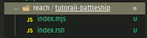

# Tutorial: BattleShip

In this Tutorail, we'll walk through a simple decentralized application, the Battleship game; where two players have to try to guess the positions of each ship on a Gameboard. More on battleship [here](<https://en.wikipedia.org/wiki/Battleship_(game)>).

This tutorial aims to give the required knowledge to build, test, and implement custom blockchain logic easily.

This tutorail assumes you have completed the Rock, Paper, Scissors tutorail [here](https://docs.reach.sh/tut/rps/#tut)

We assume that you’ll go through this tutorial in a directory named ~/reach/tutorial-battleship:

`$ mkdir -p ~/reach/tutorail-battleship`

And that you have a copy of Reach installed in ~/reach so you can write

`$ ../reach version`

You should start by initializing your project. In the current directory start by pasting the below command in the terminal.

`$ ../reach init`

This initializes a new reach project and creates two files, `index.rsh` and `index.mjs`.

Your folder structure should look something like this



The `index.rsh` file should look something like this.

```js
1.   'reach 0.1';
2.
3.  export const main = Reach.App(() => {
4.   const A = Participant('Alice', {
5.    // Specify Alice's interact interface here
6.   });
7.   const B = Participant('Bob', {
8.     // Specify Bob's interact interface here
9.   });
10.  init();
11.  // The first one to publish deploys the contract
12.  A.publish();
13.  commit();
14.  // The second one to publish always attaches
15.  B.publish();
16.  commit();
17.  // write your program here
19.  exit();
20. });
```

Let's break down the above code block.

Line 1. specifies the version of reach that the compiler will use.

Lines 3 creates a reach module and exports it as `main`. The syntax allows other reach contracts to import different reach modules and use their code.

Lines 4 and 7 define the various participants of the application and store the participants "Alice" and "Bob" in constants "A" and "B" respectively. That is, it tells the reach program who has access to the contract, what methods they can call and what actions they can perform.

Line 10 initializes the contract and allows for custom logic.

Line 12 and 15 are used to make private variables of each participant public and in 13 and 16, the "commit" statement ends the current consensus step and allows more local steps.

_Lets look at the `index.mjs` file next_

```ts
1. import {loadStdlib} from '@reach-sh/stdlib';
2. import * as backend from './build/index.main.mjs';
3. const stdlib = loadStdlib(process.env);
4.
5. const startingBalance = stdlib.parseCurrency(100);
6.
7. const [ accAlice, accBob ] =
8.  await stdlib.newTestAccounts(2, startingBalance);
9. console.log('Hello, Alice and Bob!');
10.
11. console.log('Launching...');
12. const ctcAlice = accAlice.contract(backend);
13. const ctcBob = accBob.contract(backend, ctcAlice.getInfo());
14.
15. console.log('Starting backends...');
16. await Promise.all([
15.  backend.Alice(ctcAlice, {
16.    ...stdlib.hasRandom,
17.    // implement Alice's interact object here
18.  }),
19.  backend.Bob(ctcBob, {
20.    ...stdlib.hasRandom,
21.    // implement Bob's interact object here
22.  }),
23. ]);

console.log('Goodbye, Alice and Bob!');
```

The above code block is not "reach" specific. For simplicity's sake, we will breeze through the code execution.

At the top, we import the required modules `loadstdlib` from `@reach/-sh/stdlib` and the reach compiled backend. We create a starting balance on line 5, then initialize two accounts we use for testing `accAlice` and `accBob` on line 7. We make `accAlice` deploy the contract and `accBob` attaches to that contract on lines 12 & 13. On lines 16 to 22, we implement both Alice's and Bob's interact objects.

This is now enough for Reach to compile and run our program. Let's try running

```bash
../reach run
```

Reach should now build and launch a Docker container for this application. Since the application doesn't do anything, you'll just see a lot of diagnostic messages though, so that's not very exciting

## Battleship custom logic

Let's start by defining the processes and steps that will take place in the application.

- Two participants `A` and `B` will connect to the contract.
- `A` sets a wager and a deadline and pays the wager amount into the contract.
- `B `accepts the wager and pays into the contract
- Both participants take turns placing their ships on a board with 100 spots.
- The contract makes sure that `A ` doesn't know the contents of `B`'s board and vice versa.
- `A` takes a turn trying to guess the position of the ships placed on `B`'s board.
- `B` takes their turn trying to hit the ships on `A`'s board.
- The game ends when all the ships on any player's board have been hit.

## Implementation

Now we should implement the code logic for our `index.rsh` and `index.mjs`.  
 We start by adding the new interface objects that both participants have in common.

```js
1. const common = {
2.   getBoard: Fun([], Array(UInt, 100)),
3.   Ship: Array(Bool, 15),
4.   updateShip: Fun([], Null),
5.   seeOutcome: Fun([Bool], Null),
6.   informTimeout: Fun([], Null),
7.   getShip: Fun([], Array(Bool, 15)),
8.   getHand: Fun([], UInt),
9. };
```
The `common` object contains all the functions and methods that both participants will inherit and use. 
- `getBoard` is a function that gets an array of 100 UInts that contains the positions of the ships, which are represented by "1".
- `Ship` is a variable that is used to store an array of booleans that will represent the state of all the ships that have been hit. "False"  if the ship has not been hit and "true" if has been hit.
- `updateShip` updates the `Ship` and it is only called if a ship has been hit on the board.
- `seeOutcome` is used to display the winner of the game.
- `informTimeout` is used to notify the participants of a timeout; and tell them they're taking too long to respond.
- `getShip` gets the updated `Ship` variable from the front.
- `getHand` this is then used to guess the position of a ship on another player's game board.

From here we define the player's interact functions and create helper functions.
```js
13. export const main = Reach.App(() => {
14.  const Alice = Participant("Alice", {
15.    ...common,
16.    wager: UInt,
17.    deadline: UInt,
18.  });
19.  const Bob = Participant("Bob", {
20.    ...common,
21.    acceptWager: Fun([UInt], Null),
22.  });
23.  init();
24.
25.  const informTimeout = () => {
26.    each([Alice, Bob], () => {
27.      interact.informTimeout();
28.    });
29.  };
30.  const countShips = (ships) => Array.count(ships, (item) => {
31.    return item == true;
32.  });
33.  const winner = (AliceShips, BobShips) => AliceShips[14] ? true : BobShips[14] ? false : true
34.
```  
- Lines 14 to 18 create Participant `Alice` and give it its participant interface.
- Lines 19 to 21 define the participant `Bob` and give it its participant interface  
- Line 15 and 20 use the spread operator to add all the properties of `common` to the respective participant classes
- Line 25 initializes a function `informTimeout` that when called will call each participant's timeout Function that was defined in the `common` object.
- Line 30 initializes a function `countShips` that takes in an array of booleans and counts the number of true elements, to help determine if all the ships have been hit.
- Line 33 initializes a function `winner` that calculates the winner of the game.

The application is beginning to take shape. We have defined the params and helper functions that will be used throughout the, now we begin the implementation.  
```js
36.  Alice.only(() => {
37.    const board = declassify(interact.getBoard());
38.    const wager = declassify(interact.wager);
39.    const deadline = declassify(interact.deadline);
40.    const shipAlice = declassify(interact.Ship);
41.  });
42.
43.  Alice.publish(wager, deadline, shipAlice).pay(wager);
44.  commit();
45.
46.  Bob.only(() => {
47.    const board = declassify(interact.getBoard());
48.    interact.acceptWager(wager);
49.  });
50.
51.  /** 
52.   * Make sure neither parties have acces to each other board
53.   */
54.  unknowable(Bob, Alice(board));
55.  unknowable(Alice, Bob(board));
56.
57.
58.  Bob.pay(wager).timeout(relativeTime(deadline), () =>
59.    closeTo(Alice, informTimeout)
60.  );
61.
```
- Lines 36 to 42 indicate that it is an action that only Alice performs. Alice gets the `board`, `wager`, `deadline` and `AliceShip` from the front end of our application.
- Line 43 Alice publishes the `wager`, `deadline`, and `shipAlice` variables, and makes them available to the entire application. Alice also pays the wager amount gotten from the front-end into the contract, by appending the `pay` method to the `publish`. 

If you'd notice alice makes every other variable available but, keeps the board to only herself. The reason is Bob isn't supposed to know what is on Alice's board and vice versa. So the board of each participant mustn't be shared. 
- Lines 46 to 49 indicate an action that only Bob performs. Bob gets the board from the front end and keeps it to himself by not publishing it. Bob also informs the front-end that the wager should be accepted by calling `interact.acceptWager(wager)`.
- Lines 54 and 55 do a check and make sure that neither Alice nor Bob know the contents of the opponent's board. Just an extra layer of security to ensure honesty.
- Line 58; Bob is prompted to pay the wager amount specified by Alice if he accepts the wager. The timeout method ensures that if Bob refuses to pay the wager or for some reason is unable to pay; when the timer runs out, the code block will be executed.

Moving forward to the main application logic, we have a loop that will run until the application execution ends and a winner is decided. It will look something like this.

```js
62.  var statement = [true, 0, 0, shipAlice, shipAlice];
63.  invariant(balance() == 2 * wager);
64.  while (statement[0]) {
65.    const [isTrue, aliceShipCount, BobShipsCount, A, B] = statement
66.    commit();
67.
68.    // Get Alice's Hand
69.    Alice.only(() => {
70.      const handAlice = declassify(interact.getHand());
71.    });
72.    Alice.publish(handAlice);
73.    commit();
74.
75.    // Bob Plays his Hand
76.    // Compare with bobs Board and check if it's been hit
77.
78.    Bob.only(() => {
79.      const bobHand = declassify(interact.getHand());
80.      const BobVal = board[handAlice % 100] == 1;
81.      if (BobVal) {
82.        interact.updateShip();
83.      }
84.      const BobShips = declassify(interact.getShip());
85.      check(countShips(BobShips) <= BobShipsCount + 1, "Dishonest front")
86.    });
87.    Bob.publish(bobHand, BobShips);
88.    commit();
89.
90.    // Alice Checks if the she has been hit and then publishes the result
91.    Alice.only(() => {
92.      const val = board[bobHand % 100] == 1;
93.      if (val) {
94.        interact.updateShip();
95.      }
96.      const AliceShips = declassify(interact.getShip());
97.      check(countShips(AliceShips) <= aliceShipCount + 1, "Dishonest front")
98.
99.    });
100.    Alice.publish(AliceShips);
101.
102.    const countBob = countShips(BobShips)
103.    const countAlice = countShips(AliceShips);
104.
105.    statement = [
106.      AliceShips[14] || BobShips[14] ? false : true,
107.      countAlice,
108.      countBob,
109.      AliceShips, BobShips
110.    ]
111.    continue;
112.  }

```

Bringing the application together; will look something like this...

```js
1.  "reach 0.1";
2.
3. const common = {
4.  getBoard: Fun([], Array(UInt, 100)),
5.  Ship: Array(Bool, 15),
6.  updateShip: Fun([], Null),
7.  seeOutcome: Fun([Bool], Null),
8.  informTimeout: Fun([], Null),
9.  getShip: Fun([], Array(Bool, 15)),
10.  getHand: Fun([], UInt),
11. };
12.
13. export const main = Reach.App(() => {
14.  const Alice = Participant("Alice", {
15.    ...common,
16.    wager: UInt,
17.    deadline: UInt,
18.  });
19.  const Bob = Participant("Bob", {
20.    ...common,
21.    acceptWager: Fun([UInt], Null),
22.  });
23.  init();
24.
25.  const informTimeout = () => {
26.    each([Alice, Bob], () => {
27.      interact.informTimeout();
28.    });
29.  };
30.  const countShips = (ships) => Array.count(ships, (item) => {
31.    return item == true;
32.  });
33.  const winner = (AliceShips, BobShips) => AliceShips[14] ? true : BobShips[14] ? false : true
34.
35.
36.  Alice.only(() => {
37.    const board = declassify(interact.getBoard());
38.    const wager = declassify(interact.wager);
39.    const deadline = declassify(interact.deadline);
40.    const shipAlice = declassify(interact.Ship);
41.  });
42.
43.  Alice.publish(wager, deadline, shipAlice).pay(wager);
44.  commit();
45.
46.  Bob.only(() => {
47.    const board = declassify(interact.getBoard());
48.    interact.acceptWager(wager);
49.  });
50.
51.  /** 
52.   * Make sure neither parties have acces to each other board
53.   */
54.  unknowable(Bob, Alice(board));
55.  unknowable(Alice, Bob(board));
56.
57.
58.  Bob.pay(wager).timeout(relativeTime(deadline), () =>
59.    closeTo(Alice, informTimeout)
60.  );
61.
62.  var statement = [true, 0, 0, shipAlice, shipAlice];
63.  invariant(balance() == 2 * wager);
64.  while (statement[0]) {
65.    const [isTrue, aliceShipCount, BobShipsCount, A, B] = statement
66.    commit();
67.
68.    // Get Alice's Hand
69.    Alice.only(() => {
70.      const handAlice = declassify(interact.getHand());
71.    });
72.    Alice.publish(handAlice);
73.    commit();
74.
75.    // Bob Plays his Hand
76.    // Compare with bobs Board and check if it's been hit
77.
78.    Bob.only(() => {
79.      const bobHand = declassify(interact.getHand());
80.      const BobVal = board[handAlice % 100] == 1;
81.      if (BobVal) {
82.        interact.updateShip();
83.      }
84.      const BobShips = declassify(interact.getShip());
85.      check(countShips(BobShips) <= BobShipsCount + 1, "Dishonest front")
86.    });
87.    Bob.publish(bobHand, BobShips);
88.    commit();
89.
90.    // Alice Checks if the she has been hit and then publishes the result
91.    Alice.only(() => {
92.      const val = board[bobHand % 100] == 1;
93.      if (val) {
94.        interact.updateShip();
95.      }
96.      const AliceShips = declassify(interact.getShip());
97.      check(countShips(AliceShips) <= aliceShipCount + 1, "Dishonest front")
98.
99.    });
100.    Alice.publish(AliceShips);
101.
102.    const countBob = countShips(BobShips)
103.    const countAlice = countShips(AliceShips);
104.
105.    statement = [
106.      AliceShips[14] || BobShips[14] ? false : true,
107.      countAlice,
108.      countBob,
109.      AliceShips, BobShips
110.    ]
111.    continue;
112.  }
113.
114.  const [isTrue, aliceShipCount, BobShipsCount, AliceShips, BobShips] = statement
115.
116.  const outcome = winner(AliceShips, BobShips);
117.  transfer(2 * wager).to(outcome ? Alice : Bob);
118.  commit();
119.
120.  each([Alice, Bob], () => {
121.    interact.seeOutcome(outcome);
122.  });
123. });
```

What information are they going to discover and use in the program?

Waht are the steps to be taken in the course of the program?

What funds change ownership during the application and how?

```

**Question Answers!**
```

Our application involves 2 roles: One deployer and one attacher.

Deployer knows about the price of the wager they want to set for the game, and the deadline for deployer to connect.

Attacher will be informed about the price of the wager set by the deployer.

Both attacher and deployer pay wager to the contract.

Deployer and attacher place the ships on their gameboard.

Deplopyer and Attacher take turns guessing the position of the ships of the other

At the end of the game, the winner gets paid all the wagers, or in the case of a draw, both players get refunded.

````

## Data Definition
For the next step, we are going to define the data type equivalents of the values used in our answers from the previous section. Also, in this step we'll be deciding what functions our participants will have.

* What functions/values does Deployer need to deploy the game, play and observe outcomes?

* What functions/values does attacher need to attach, play and observe outcomes?

* What functions do both participants have in common?

It's time to see our answers!

First we'll define a common object that contains the functions both participants have in common.

```js
const common = {
  getBoard: Fun([], Array(UInt, 100)),
  Ship: Array(Bool, 15),
  informTimeout: Fun([], Null),
  seeOutcome: Fun([Bool], Null),
  updateShip: Fun([], Null),
  getShip: Fun([], Array(Bool, 15)),
  getHand: Fun([], UInt),
  setPlayer: Fun([Bool], Null),
};
````

Then we'll define each individual participant's unique function, but also pass the generic ones to both.

```js
export const main = Reach.App(() => {

  const Alice = Participant("Alice", {
    ...common,
    wager: UInt,
    deadline: UInt,
  });
  const Bob = Participant("Bob", {
    ...common,
    acceptWager: Fun([UInt], Null),
  });
```

We're going to represent the cost of a wager with UInt (Unsigned Integer). Deployer will set this value after deploying the contract. We'll also represent the duration of a deadline with UInt.

Attacher has a function that lets them view and accept the wager set by the deployer. They'll have the option of refusing it and thus terminating the contract.

For the actual gameplay, both participants have 7 functions.

- `getBoard` for getting the gameboard information of each player, and it specifies the positions of the ships,
- `Ship` which is an array that contains booleans that signify the number of ships each player is allowed to have,
- `informTimeout` for letting them know when there is a timeout,
- `seeOutcome` for telling them the overall winner of all three stages,d
- `updateShip` for updateing the the ships object to show how many ships have been hit,
- `getShip` getting the updated ship value from the front-end,
- `getHand` for getting each players guess.

## Communication Construction

Now we can design the structure and flow of communication of our application.

```
1. Deployer sets wager, deploys contract and pays wager.
2. Attacher sees, accepts and pays wager.
3. Attacher and Deployer both get their board information.
4. Program checks for dishonest actors
5. In multiple iterations:
  i.  Deployer plays hand and the program checks if it correlates with a ship position on the Attacher's board
  ii. Attacher confirms if Deployer's hand correlates and plays hand
  iii. Program checks if Attacher's hand correlates with ship position on Deployer's board
  iv. Program checks if all ships on any participant's board has been hit.
6. Program checks winner.
5. Program pays winner both wagers or refunds both players in the case of a draw.
```

The phrase "In multiple iterations" indicates a loop in the game that runs an unknown amount of times, until a conditionis met. With this information we can implement the logic for our contract.
Main logic of our contract should now look like:

```js
    const informTimeout = () => {
    each([Alice, Bob], () => {
      interact.informTimeout();
    });
  };
  const countShips = (ships) => Array.count(ships, (item) => {
    return item == true;
  });
  const winner = (AliceShips, BobShips) => AliceShips[14] ? true : BobShips[14] ? false : true


  Alice.only(() => {
    const board = declassify(interact.getBoard());
    const wager = declassify(interact.wager);
    const deadline = declassify(interact.deadline);
    const shipAlice = declassify(interact.Ship);
  });

  Alice.publish(wager, deadline, shipAlice).pay(wager);
  commit();

  Bob.only(() => {
    const board = declassify(interact.getBoard());
    interact.acceptWager(wager);
  });

  /**
   * Make sure neither parties have acces to each other board
   */
  unknowable(Bob, Alice(board));
  unknowable(Alice, Bob(board));


  Bob.pay(wager).timeout(relativeTime(deadline), () =>
    closeTo(Alice, informTimeout)
  );
  require(balance() == 2 * wager);

  var statement = [true, 0, 0, shipAlice, shipAlice];
  invariant(balance() == 2 * wager);
  while (statement[0]) {
    const [isTrue, aliceShipCount, BobShipsCount, A, B] = statement
    commit();

    // Get Alice's Hand
    Alice.only(() => {
      const handAlice = declassify(interact.getHand());
    });
    Alice.publish(handAlice);
    commit();

    // Bob Plays his Hand
    // Compare with bobs Board and check if it's been hit

    Bob.only(() => {
      const bobHand = declassify(interact.getHand());
      const BobVal = board[handAlice % 100] == 1;
      if (BobVal) {
        interact.updateShip();
      }
      const BobShips = declassify(interact.getShip());
      check(countShips(BobShips) <= BobShipsCount + 1, "Dishonest front")
    });
    Bob.publish(bobHand, BobShips);
    commit();

    // Alice Checks if the she has been hit and then publishes the result
    Alice.only(() => {
      const val = board[bobHand % 100] == 1;
      if (val) {
        interact.updateShip();
      }
      const AliceShips = declassify(interact.getShip());
      check(countShips(AliceShips) <= aliceShipCount + 1, "Dishonest front")

    });
    Alice.publish(AliceShips);

    const countBob = countShips(BobShips)
    const countAlice = countShips(AliceShips);

    statement = [
      AliceShips[14] || BobShips[14] ? false : true,
      countAlice,
      countBob,
      AliceShips, BobShips
    ]
    continue;
  }

  const [isTrue, aliceShipCount, BobShipsCount, AliceShips, BobShips] = statement

  const outcome = winner(AliceShips, BobShips);
  transfer(2 * wager).to(outcome ? Alice : Bob);
  commit();

  each([Alice, Bob], () => {
    interact.seeOutcome(outcome);
  });
});
```

## Assertion Insertion

Due to simplicity of the program, there's no need for assertions in the code.

## Possible Additions

Our code works perfectly fine as it is now. But can be implemented and represented better by using APIs instead of Participants for the player interactions

## Testing

We test our application by creating a file `index.mjs` in the same directory as the `index.rsh`

```bash
touch index.mjs
```

We define our test data to use for simulating user input and data

```js
export const Data = [
  1, 1, 1, 1, 1, 1, 1, 1, 1, 1, 1, 0, 1, 1, 1, 1, 1, 1, 0, 0, 0, 0, 0, 0, 0, 0,
  0, 0, 0, 0, 0, 0, 0, 0, 0, 0, 0, 0, 0, 0, 0, 0, 0, 0, 0, 0, 0, 0, 0, 0, 0, 0,
  0, 0, 0, 0, 0, 0, 0, 0, 0, 0, 0, 0, 0, 0, 0, 0, 0, 0, 0, 0, 0, 0, 0, 0, 0, 0,
  0, 0, 0, 0, 0, 0, 0, 0, 0, 0, 0, 0, 0, 0, 0, 0, 0, 0, 0, 0, 0, 0,
];
export const playerChoice = [
  0, 1, 2, 3, 4, 5, 6, 7, 8, 9, 0, 1, 2, 3, 4, 5, 6, 7, 7, 8, 8, 8, 8, 8, 8, 8,
];
```

On the Data array "0"s represent spaces on the board without ships and the "1"s represent ships.

The player choice array contains all the moves the test suite will guess on the board.

Now we run the tests below:

```js
import { loadStdlib } from "@reach-sh/stdlib";
import * as backend from "./build/index.main.mjs";

export const Data = [
  1, 1, 1, 1, 1, 1, 1, 1, 1, 1, 1, 0, 1, 1, 1, 1, 1, 1, 0, 0, 0, 0, 0, 0, 0, 0,
  0, 0, 0, 0, 0, 0, 0, 0, 0, 0, 0, 0, 0, 0, 0, 0, 0, 0, 0, 0, 0, 0, 0, 0, 0, 0,
  0, 0, 0, 0, 0, 0, 0, 0, 0, 0, 0, 0, 0, 0, 0, 0, 0, 0, 0, 0, 0, 0, 0, 0, 0, 0,
  0, 0, 0, 0, 0, 0, 0, 0, 0, 0, 0, 0, 0, 0, 0, 0, 0, 0, 0, 0, 0, 0,
];
export const playerChoice = [
  0, 1, 2, 3, 4, 5, 6, 7, 8, 9, 0, 1, 2, 3, 4, 5, 6, 7, 7, 8, 8, 8, 8, 8, 8, 8,
];

const stdlib = loadStdlib();
const startingBalance = stdlib.parseCurrency(100);
const arr = Data;

console.log(arr);

const accAlice = await stdlib.newTestAccount(startingBalance);
const accBob = await stdlib.newTestAccount(startingBalance);

const getBalance = async (who) =>
  stdlib.formatCurrency(await stdlib.balanceOf(who), 4);
const beforeAlice = await getBalance(accAlice);
const beforeBob = await getBalance(accBob);

const ctcAlice = accAlice.contract(backend);
const ctcBob = accBob.contract(backend, ctcAlice.getInfo());
const Player = () => {
  const interact = { ...stdlib.hasRandom };
  let Ship = [
    false,
    false,
    false,
    false,
    false,
    false,
    false,
    false,
    false,
    false,
    false,
    false,
    false,
    false,
    false,
  ];
  const getBoard = () => {
    console.log(`Bob asked to give the preimage.`);
    return arr;
  };
  let i = 0;
  const updateShip = () => {
    for (let singleShip in Ship) {
      if (Ship[singleShip] === false) {
        Ship[singleShip] = true;
        break;
      }
    }
  };
  const getShip = () => {
    return Ship;
  };
  const informTimeout = () => {
    console.log(`someone observed a timeout`);
  };
  const seeOutcome = () => {
    console.log(`someone saw outcome `);
  };
  const getHand = () => {
    i++;
    return playerChoice[i % 10];
  };
  return {
    Ship,
    getBoard,
    updateShip,
    informTimeout,
    seeOutcome,
    getShip,
    getHand,
  };
};

await Promise.all([
  backend.Alice(ctcAlice, {
    ...Player(),
    amt: stdlib.parseCurrency(25),
    deadline: 10,
    wager: stdlib.parseCurrency(10),
  }),
  backend.Bob(ctcBob, {
    ...Player(),
    acceptWager: async () => {
      if (Math.random() >= 1) {
        for (let i = 0; i < 10; i++) {
          console.log(`  Bob takes his sweet time...`);
          await stdlib.wait(1);
        }
      } else {
        await stdlib.wait(1);
        console.log(`Bob accepts the wager .`);
      }
    },
  }),
]);

const afterAlice = await getBalance(accAlice);
const afterBob = await getBalance(accBob);

console.log(`Alice went from ${beforeAlice} to ${afterAlice}.`);
console.log(`Bob went from ${beforeBob} to ${afterBob}.`);
```

## Interaction Introduction

Now we have a complete contract backend and test suite, now we can write the frontend. You can use any frontend library of your choice. In our case, we have chosen to use React.

NOTE: To fully utilize this section you need to have the repo locally [link](https://github.com/prince-hope1975/battleship-main)

In the React App navigate to `battleship-main/src/factories/playerFactory.js`. We are defining the logic for the participants

```js
import Gameboard from "./gameboardFactory";
import * as backend from "../build/index.main.mjs";
import { loadStdlib } from "@reach-sh/stdlib";
/*
Helper Funtions
*/
const callbackFn = () => {
  let fn;
  const setFn = (fxn) => {
    fn = fxn;
    console.log("fxn", fxn);
  };
  const callFn = (val) => {
    fn(val);
  };
  return {
    setFn,
    callFn,
  };
};
const Fxn = callbackFn();
const Waiter = callbackFn();

const reach = loadStdlib((process.env.REACH_CONNECTOR_MODE = "ALGO"));
/**
 * Participant classes
 */
class Player {
  constructor(name, acc) {
    this.name = name;
    this.ctc = null;
    this.Ship = [
      false,
      false,
      false,
      false,
      false,
      false,
      false,
      false,
      false,
      false,
      false,
      false,
      false,
      false,
      false,
    ];
    this.acc = acc;
    this.gameBoard = new Gameboard();
  }
  updateShip() {
    for (let singleShip in this.Ship) {
      if (this.Ship[singleShip] === false) {
        this.Ship[singleShip] = true;
        break;
      }
    }
  }
  getBoard() {
    return this.gameBoard.board.map((item) => {
      if (item.hasShip !== false) return 1;
      return 0;
    });
  }
  getShip() {
    return this.Ship;
  }
  informTimeOut() {
    console.log("You observed a timeout");
  }
  setPlayer(Bool) {
    this.currentPlayer = Bool;
  }
  async getHand() {
    console.log(`Please Play your hand ${this.name}`);
    if (this.name.toLowerCase() !== "computer") {
      alert("All systems go! go! go!, Fireeeeee");
    }
    const hand = await new Promise((resolveHandP) => {
      if (this.name.toLowerCase() === "computer") {
        Waiter.callFn(true);
      }
      this.resolveHandP = resolveHandP;
      Fxn.setFn(resolveHandP);
    });
    return hand;
  }
  async waitTillHandGot() {
    const hand = await new Promise((resolveHandP) => {
      Waiter.setFn(resolveHandP);
    });
    return hand;
  }
  playHand(hand) {
    console.log("hand,", hand);
    Fxn.callFn(hand);
    if (this.name.toLowerCase() === "computer") {
      alert(
        "Enemy has fired, we are sendig the intel to HQ\n Please do not shoot until instructed to"
      );
    }
  }
  fireShot(location, gameboard) {
    if (gameboard.opponentBoard()[location] === "empty") {
      gameboard.receiveShot(location);
    }
  }
}

/**
 * Deployer class which inherits from general player class
 * */
export class Deployer extends Player {
  setWager(wager) {
    this.wager = wager;
    console.log(this);
  }
  async deploy(reach) {
    this.ctc = this.acc.contract(backend);
    this.wager = reach.parseCurrency(this.wager); // UInt
    this.deadline = {
      ETH: 10,
      ALGO: 100,
      CFX: 1000,
    }[reach.connector]; // UInt
    backend.Alice(this.ctc, this);
    alert("Contract is being deployed... Please wait");
    const ctcInfoStr = JSON.stringify(await this.ctc.getInfo(), null, 2);
    console.log("info", ctcInfoStr);
    alert("Contract successfully deployed, Please wait for someone to attach");
    this.ctcInfoStr = ctcInfoStr;
  }
}

export class Attacher extends Player {
  acceptWager(wagerAtomic) {
    const wager = reach.formatCurrency(wagerAtomic, 4);
    console.log("Accepted Wager, ", wager);
  }

  async attach(ctcInfoStr) {
    this.ctc = this.acc.contract(backend, JSON.parse(ctcInfoStr));
    backend.Bob(this.ctc, this);
    await this.ctc.getInfo();
    alert(
      "Contract has been sucessfully attached to, Please wait till you are given orders to fire"
    );
  }
}

export default Player;
```

We'll navigate to the `battleship-main/src/components/game_window/GameWindow.js` which houses the initial game logic

```js
import React, {
  useState,
  useContext,
  useEffect,
  useRef,
  useCallback,
} from "react";
import Init from "./Init";
import GameSetup from "./GameSetup";
import GameStart from "./GameStart";
import WinnerScreen from "./WinnerScreen";
import { store } from "../../GameController";
import {
  MainWindow,
  VolumeContainer,
} from "../styled_components/gameControllerStyles";
import music from "../../assets/sounds/music.mp3";
import backgroundSound from "../../assets/sounds/background_sound.mp3";
import fireShot from "../../assets/sounds/fire_shot.mp3";
import shotHit from "../../assets/sounds/shot_hit.mp3";
import shotMiss from "../../assets/sounds/shot_miss.mp3";
import VolumeOn from "../icons/VolumeOn";
import VolumeOff from "../icons/VolumeOff";

import secret from "../../secret";

/***
 * REACH
 */
import { loadStdlib } from "@reach-sh/stdlib";
import { ALGO_MyAlgoConnect as MyAlgoConnect } from "@reach-sh/stdlib";
const reach = loadStdlib((process.env.REACH_CONNECTOR_MODE = "ALGO-live"));

reach.setWalletFallback(
  reach.walletFallback({
    providerEnv: "TestNet",
    MyAlgoConnect,
  })
);

export default function GameWindow() {
  const { state, dispatch } = useContext(store);
  const { timeline, winner } = state;
  const [dismount, setDismount] = useState(false);
  const [volume, setVolume] = useState(true);

  // pass to props to avoiding directly passing a setState function
  const setVolumeProps = (value) => {
    value
      ? (musicPlayer.current.volume = 0.5)
      : (musicPlayer.current.volume = 0);
    setVolume(value);
  };

  const musicPlayer = useRef();
  // I provide two sound players so sound effects can "overlap"
  const soundPlayer = useRef();
  const soundPlayer2 = useRef();

  // cancel animation coming into this component
  useEffect(() => {
    setDismount(false);
    console.log("hi");
  }, [setDismount]);

  useEffect(() => {
    (async () => {
      try {
        const newAccount = await reach.newAccountFromMnemonic(secret);
        console.log("newAccount", newAccount);

        dispatch({ type: "SET_ACC", payload: newAccount });
        dispatch({ type: "SET_BOB", payload: newAccount });
      } catch (error) {
        console.error(error);
      }
    })();
  }, []);

  // to avoid passing a setState directly, pass this helper function
  const setDismountProp = (state) => {
    setDismount(state);
  };

  const playBgSound = useCallback(
    (sound, customVolume) => {
      if (volume) {
        const newVol = customVolume || 0.5;
        if (!musicPlayer.current.paused) musicPlayer.current.pause();
        musicPlayer.current.src =
          sound === "music"
            ? music
            : sound === "bgSound"
            ? backgroundSound
            : null;
        musicPlayer.current.load();
        musicPlayer.current.volume = newVol;
        musicPlayer.current.play();
      }
    },
    [volume]
  );

  const playSound = useCallback(
    (sound, customVolume) => {
      if (volume) {
        const newVol = customVolume || 0.5;
        let player = soundPlayer;
        if (!soundPlayer.current.paused) {
          player = soundPlayer2;
        }
        player.current.src =
          sound === "fireShot"
            ? fireShot
            : sound === "shotMiss"
            ? shotMiss
            : sound === "shotHit"
            ? shotHit
            : null;
        player.current.load();
        player.current.volume = newVol;
        player.current.play();
      }
    },
    [volume]
  );

  const checkIfMusicPaused = () => {
    return musicPlayer.current.paused;
  };

  const fadeOutMusic = () => {
    const fadeOut = setInterval(() => {
      if (musicPlayer.current.volume <= 0.04) {
        musicPlayer.current.volume = 0;
        clearInterval(fadeOut);
      } else {
        musicPlayer.current.volume = musicPlayer.current.volume - 0.03;
      }
    }, 30);
  };

  // conditionally render based on the app state "timeline"
  const renderChild = (timeline) => {
    return timeline === "init" ? (
      <Init
        playBgSound={playBgSound}
        checkIfMusicPaused={checkIfMusicPaused}
        dismount={dismount}
        setDismount={setDismountProp}
      />
    ) : timeline === "setup" ? (
      <GameSetup
        dismount={dismount}
        fadeOutMusic={fadeOutMusic}
        setDismount={setDismountProp}
      />
    ) : winner ? (
      <WinnerScreen playBgSound={playBgSound} />
    ) : !winner ? (
      <GameStart
        playSound={playSound}
        playBgSound={playBgSound}
        setDismount={setDismount}
      />
    ) : null;
  };

  return (
    <MainWindow>
      <VolumeContainer timeline={timeline}>
        {volume ? (
          <VolumeOn setVolume={setVolumeProps} />
        ) : (
          <VolumeOff setVolume={setVolumeProps} />
        )}
      </VolumeContainer>
      {renderChild(timeline)}
      <>
        <audio onEnded={() => musicPlayer.current.play()} ref={musicPlayer} />
        <audio ref={soundPlayer} />
        <audio ref={soundPlayer2} />
      </>
    </MainWindow>
  );
}
```

The frontend's structure is fairly complex so you'll have to properly go through the repository to get the pieces together.

## Discussion

Congrats for finishing this tutorial. You implemented the gold rush game that runs on the blockchain yourself.

If you found this tutorial rewarding please let us know on [the Discord Community](https://discord.gg/AZsgcXu).

Thanks!!
